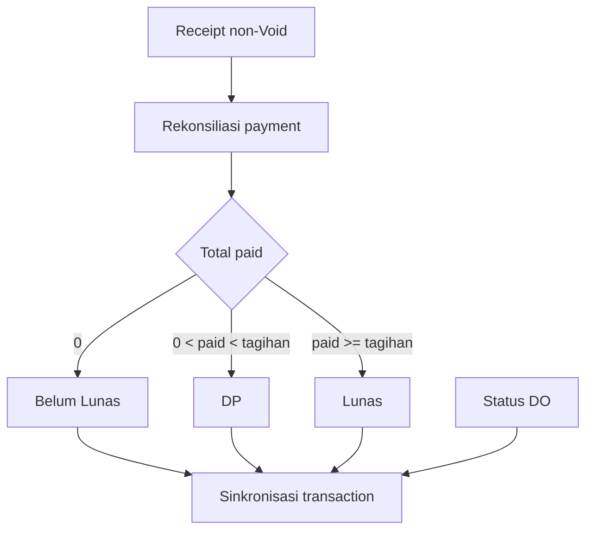
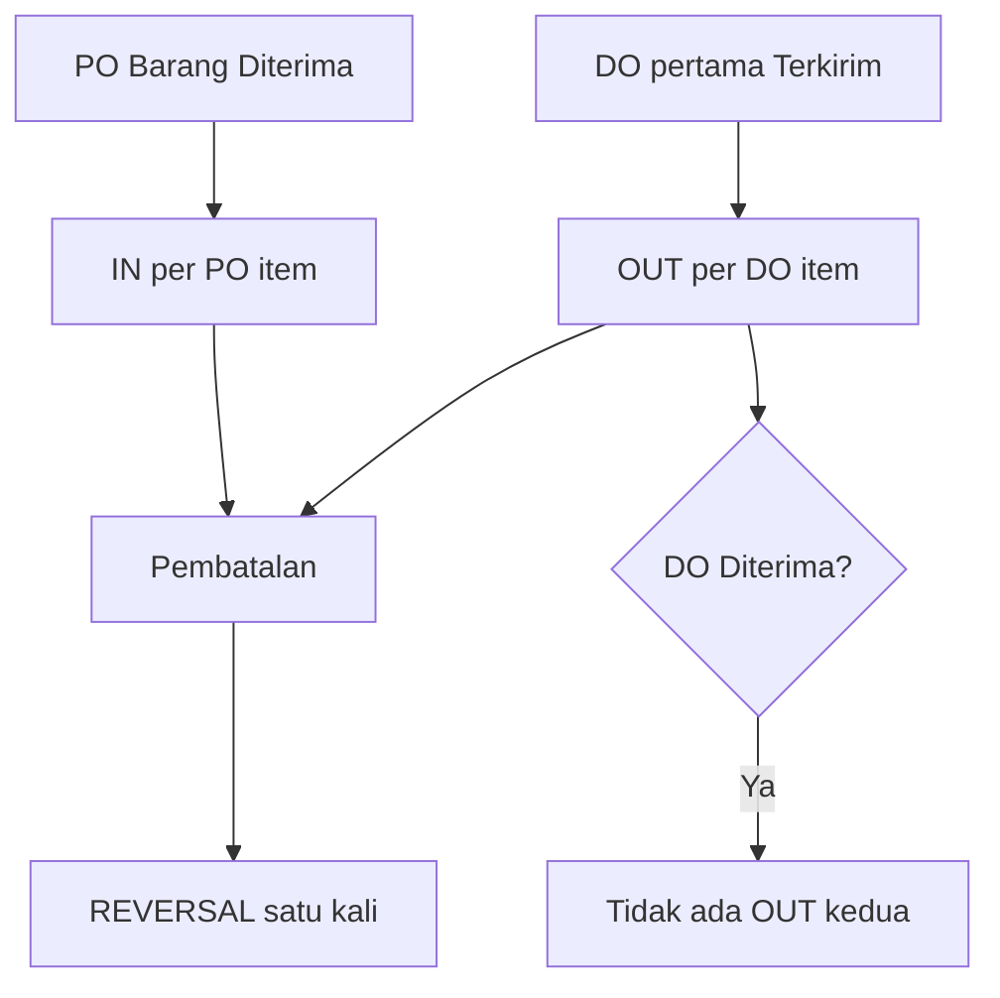

# Sprint 10B — Workflow Integrity Engine

## 1. Ringkasan

Sprint 10B menutup gap P0 hasil audit Sprint 10A pada payment, sinkronisasi status, downstream guard, stock posting, reversal, dan idempotency. Implementasi memakai service server-side terpusat di `app/workflow_integrity.py`. Database production tidak digunakan dan tidak dimigrasikan.

Hasil utama:

- Receipt non-Void menjadi satu-satunya sumber `jumlah_dibayar`, `sisa_tagihan`, dan status pembayaran invoice.
- Status transaction dihitung dari kondisi invoice dan Delivery Order, bukan urutan route.
- Dokumen Batal/Expired dan dokumen yang sudah mempunyai downstream dilindungi server-side.
- PO Barang Diterima mem-posting stock `IN`; DO pertama kali Terkirim mem-posting `OUT`; Diterima tidak mem-posting ulang.
- Cancellation menghasilkan movement `REVERSAL`, tidak menghapus movement asli.
- Constraint database mencegah conversion, PO, receipt, dan stock posting ganda.
- Seluruh 99 regression lulus: 81 existing dan 18 workflow-integrity.

## 2. Root cause

| Area | Akar masalah sebelum Sprint 10B | Dampak |
|---|---|---|
| Payment | Status dan jumlah bayar invoice dapat diubah langsung, terpisah dari receipt | Invoice dapat Lunas tanpa bukti receipt |
| Void | Void hanya menghitung invoice secara parsial dan tidak selalu menyinkronkan transaction | Transaction dapat tetap Lunas setelah payment di-Void |
| Status | Route payment dan delivery menulis status transaction secara independen | Hasil bergantung urutan paid/delivered |
| Downstream | Guard tidak konsisten pada direct POST | Dokumen Batal/Expired dapat menghasilkan downstream |
| Stock | PO/DO hanya mengubah status | Stock tidak mengikuti barang diterima/dikirim |
| Idempotency | Proteksi dominan berupa query aplikasi tanpa constraint | Retry/concurrency masih dapat menggandakan data |

## 3. Transition rules

### Payment dan transaction



| Invoice aktif | Status DO | Status transaction |
|---|---|---|
| Tidak ada | Tidak ada | Draft atau Closing bila berasal dari quotation |
| Belum Lunas/DP | Belum Terkirim | Invoice |
| Lunas | Belum Diterima | Lunas |
| Belum Lunas/DP | Terkirim/Diterima | Terkirim |
| Lunas | Diterima | Selesai |
| Invoice Batal | Semua | Invoice dianggap tidak aktif; kondisi DO tetap diperhitungkan |

Urutan `paid → delivered` dan `delivered → paid` memakai helper yang sama dan menghasilkan status akhir identik. Quotation sumber tetap `Deal`, karena vocabulary quotation existing belum mempunyai `Closed/Selesai`.

### Delivery Order

Transisi maju yang diizinkan: Draft → Packing/Siap Kirim/Terkirim; Packing → Siap Kirim/Dalam Pengiriman/Terkirim; Siap Kirim → Dalam Pengiriman/Terkirim; Dalam Pengiriman → Terkirim; Terkirim → Diterima. Batal adalah terminal. Pembatalan setelah OUT membuat reversal satu kali.

### Purchase Order

Transisi maju yang diizinkan: Draft → Dikirim/Diproses Supplier/Barang Diterima; Dikirim → Diproses Supplier/Barang Diterima; Diproses Supplier → Barang Diterima; Barang Diterima → Selesai. Batal adalah terminal. Pembatalan setelah IN membuat reversal satu kali bila tidak menjadikan stock negatif.

## 4. Payment reconciliation

Formula server-side:

```text
total_tagihan = max(transaction.total_penjualan - transaction.potongan, 0)
total_paid = SUM(payment_receipts.nominal WHERE status != 'Void')
sisa_tagihan = max(total_tagihan - total_paid, 0)
```

Aturan:

- User tidak dapat menandai invoice DP/Lunas secara manual.
- Field `jumlah_dibayar` dan `dp_persen` pada edit invoice tidak dipercaya.
- Invoice Batal menolak receipt baru.
- Invoice hanya dapat dibatalkan setelah seluruh receipt aktif di-Void.
- Receipt tidak dapat dihapus; gunakan Void agar audit trail tetap utuh.
- Retry receipt dengan idempotency key yang sama mengarah ke receipt yang sudah ada.

## 5. Downstream guard

| Aksi | Guard server-side |
|---|---|
| Quotation → Transaction | Tolak Batal, Expired, dan identity `QUOTATION_ONLY` |
| Edit quotation | Tolak seluruh POST finansial setelah converted |
| Transaction → Invoice/DO/PO | Tolak transaction Batal |
| Invoice → Receipt/PO | Tolak invoice Batal |
| Edit transaction | Tolak setelah Invoice, DO, atau Receipt tersedia |
| Edit PO/DO | Perubahan item/finansial hanya ketika Draft |
| Status payment transaction | Status turunan tidak dapat ditulis manual |

Blocked action dicatat pada activity existing atau `workflow_events`.

## 6. Stock posting dan reversal



- Default warehouse disimpan pada `erp_settings.default_warehouse_id`.
- Bila belum dikonfigurasi, service hanya dapat memilih otomatis ketika tepat satu warehouse aktif.
- Qty stock harus bilangan bulat positif untuk item PO/DO.
- OUT melakukan preflight seluruh item sebelum update saldo.
- Stock kurang menyebabkan rollback movement dan status dalam transaction SQLite yang sama.
- Movement asli tidak dihapus. Reversal memakai `reversal_of_id` dan unique index.
- Pembatalan PO ditolak bila reversal stock IN akan membuat saldo negatif karena stock sudah terpakai.
- Opening stock memakai idempotency key eksplisit atau deterministic fallback dari payload.

## 7. Migration additive dan idempotent

### Kolom baru

| Tabel | Kolom |
|---|---|
| `payment_receipts` | `idempotency_key TEXT` |
| `stock_movements` | `source_type`, `source_id`, `source_item_id`, `idempotency_key`, `reversal_of_id` |
| `sales_transactions` | Tidak ada kolom baru; memakai `source_quotation_id` existing |
| `purchase_orders` | `warehouse_id INTEGER` |
| `delivery_orders` | `warehouse_id INTEGER` |
| `erp_settings` | `default_warehouse_id INTEGER` |

### Tabel baru

`workflow_events` menyimpan tipe/id dokumen, customer, event, status lama/baru, deskripsi, idempotency key, actor, dan timestamp. Tabel ini menjadi event recording backend; Timeline UI tidak termasuk scope.

### Constraint/index baru

| Index | Aturan |
|---|---|
| `uq_sales_transactions_source_quotation` | Satu transaction per source quotation non-null |
| `uq_purchase_orders_invoice` | Satu linked PO per invoice non-null |
| `uq_payment_receipts_idempotency` | Satu receipt per idempotency key |
| `uq_stock_movements_idempotency` | Satu stock posting per key |
| `uq_stock_movements_reversal` | Satu reversal per movement asli |
| `uq_workflow_events_idempotency` | Event idempotent tidak tercatat ganda |

Sebelum membuat unique index, migration mencari duplicate existing. Bila ditemukan, migration gagal dengan identitas key yang bermasalah. Tidak ada delete, merge, atau backfill otomatis.

## 8. Activity/event recording

Event minimum yang tercatat:

- `payment_created`, `payment_voided`, `payment_synchronized`
- `status_synchronized`, `status_changed`
- `stock_posted`, `stock_reversed`
- `action_blocked`

Activity tables existing quotation, receipt, dan Delivery Order tetap digunakan untuk kompatibilitas UI sekarang.

## 9. File berubah

| File | Perubahan |
|---|---|
| `app/database.py` | Migration additive, duplicate precheck, unique partial indexes, `workflow_events` |
| `app/workflow_integrity.py` | Payment reconciliation, deterministic status, transition validation, posting/reversal/idempotency service |
| `app/main.py` | Integrasi server-side pada quotation conversion/edit, transaction/invoice/receipt, PO, DO, dan opening stock |
| `app/templates/inventory_settings.html` | Pilihan default warehouse untuk stock posting; bukan template dokumen |
| `tests/test_workflow_integrity.py` | Regression payment, guard, status order, constraint, stock, reversal, dan rollback injection |
| `SPRINT-10B-WORKFLOW-INTEGRITY-IMPLEMENTATION.md` | Dokumen implementasi |

## 10. Regression result

Perintah:

```bash
python -m unittest discover -s tests -p "test_*.py" -v
python -m compileall -q app tests
git diff --check
```

Hasil final sebelum commit dokumentasi:

```text
Ran 99 tests in 11.511s
OK
compileall: OK
git diff --check: OK
```

Coverage Sprint 10B mencakup 30 acceptance assertions dalam 18 test terfokus, termasuk payment full/partial/void, receipt retry, seluruh downstream guard, status order-independence, PO IN, DO OUT, retry no-op, no negative stock, reversal satu kali, opening idempotency, database constraints, financial invariant, migration dua kali, dan failure injection rollback.

## 11. UAT database sementara

| Scenario | Bukti otomatis | Hasil |
|---|---|---|
| A — DP, pelunasan, Terkirim, Diterima | `test_full_and_partial_receipts_reconcile_invoice`, `test_delivery_sent_posts_one_out_and_received_posts_no_second_out`, deterministic sync | Invoice Lunas; final transaction Selesai setelah Diterima |
| B — Diterima lalu Lunas | `test_payment_delivery_order_is_deterministic_in_both_orders` | Final Selesai pada kedua urutan |
| C — PO diterima dan retry | `test_po_received_posts_one_in_and_retry_is_noop` | Tepat satu IN |
| D — DO Terkirim dan retry | `test_delivery_sent_posts_one_out_and_received_posts_no_second_out` | Tepat satu OUT; Diterima tidak membuat OUT kedua |
| E — Void payment | `test_void_full_receipt_recalculates_invoice_and_transaction` | Invoice Belum Lunas dan transaction kembali Invoice |

Seluruh scenario memakai SQLite sementara yang dibuat per test. Database production tidak disentuh.

## 12. Risiko

- Migration akan sengaja berhenti bila data existing sudah mempunyai duplicate pada key yang akan dibuat unique. Data harus diaudit dan diperbaiki melalui pekerjaan terpisah setelah backup.
- Data historis dengan status/payment/stock tidak konsisten tidak di-backfill otomatis.
- PO/DO lama tanpa warehouse membutuhkan default warehouse sebelum transition stock berikutnya.
- PO dengan qty pecahan ditolak saat stock posting karena stock existing disimpan sebagai integer.
- Pembatalan PO dapat ditolak bila barang sudah dipakai sehingga reversal akan membuat stock negatif.
- `dp_persen` tetap memakai tipe legacy `REAL`; nilai uang tetap disimpan dan dihitung sebagai integer rupiah.

## 13. Rollback

Rollback aplikasi dilakukan dengan revert commit Sprint 10B. Karena SQLite tidak mendukung drop column sederhana dan migration bersifat additive, kolom/tabel/index baru boleh dibiarkan tidak terpakai. Bila rollback schema mutlak diperlukan:

1. Hentikan aplikasi.
2. Backup file database dan jalankan `PRAGMA integrity_check`.
3. Revert kode aplikasi.
4. Jangan hapus stock movement atau workflow event.
5. Hapus index baru hanya pada salinan database setelah audit duplicate/reference.
6. Uji restore dan regression pada salinan sebelum tindakan production.

Tidak ada prosedur rollback yang menghapus payment atau stock history otomatis.

## 14. Document format freeze

Tidak ada perubahan pada template dokumen berikut terhadap `main`:

| Template | SHA-256 |
|---|---|
| `quotation_print.html` | `aa1e06fadd7c92eda999ce6d203aba92341ca4df222e7fdcaf214d4fff927fd4` |
| `invoice_print.html` | `4a79d98c15052b2229d52095050664a8b0b2709ae810e5e7b34b0fc74f6637e2` |
| `receipt_print.html` | `7f77c0bbb71c24f14720fff3a42eaa66357be4fcdd3078e2478cb7c4556b21cc` |
| `delivery_order_print.html` | `fcf647739fce72ac0a40166510502b4889922d13e966a433b55dbf92105b684a` |

`git diff --exit-code main --` terhadap keempat template menghasilkan exit code 0. Format Quotation, Invoice, Receipt, dan Delivery Order tetap identik.

## 15. Commit

- `72a1eb6` — `feat(workflow): add integrity services and safe constraints`
- `c303a70` — `fix(workflow): enforce payment status and downstream guards`
- `f5fd62f` — `test(workflow): cover integrity posting and rollback`
- `docs(workflow): document sprint 10b integrity engine` — commit dokumentasi ini.
