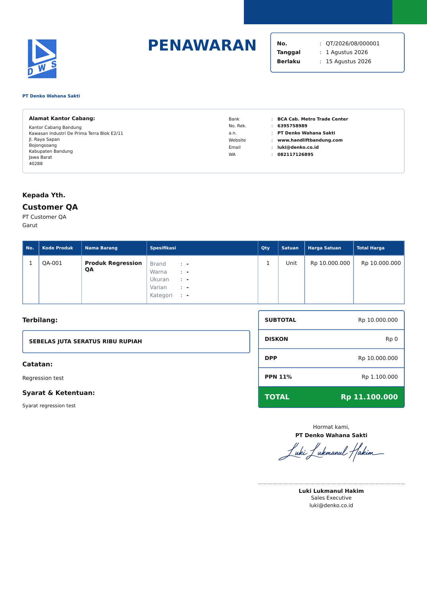

# Sprint 6.1 — PPN Quotation Denko

## 1. Ringkasan

Hotfix ini menambahkan PPN wajib 11% untuk quotation dengan identity type
`QUOTATION_ONLY` (Denko), tanpa mengubah workflow quotation dan transaksi Ahsa.
Aturan pajak ditentukan di server berdasarkan `identity_type`; nilai `is_ppn` dan
`ppn_rate` dari request tidak dipercaya.

Review PR #2 menemukan bahwa diskon global quotation Ahsa sebelumnya hanya
mengurangi header transaksi, tetapi tidak mengurangi snapshot detail transaksi.
Blocker tersebut diperbaiki dengan alokasi diskon proporsional berbasis integer,
sehingga header, detail, modal, dan margin selalu memenuhi financial invariant.

Branch implementasi: `agent/hotfix-sprint-6-denko-ppn`

Baseline: `main` commit `7a91260e30c4a692c86b06262e0912c413eb78f4`

Status: belum di-merge dan belum diterapkan pada database production.

## 2. Desain perhitungan

Harga item dianggap belum termasuk PPN. Semua nominal yang disimpan dan dihitung
berupa integer rupiah.

| Komponen | Rumus |
|---|---|
| Subtotal | Jumlah subtotal seluruh item |
| DPP | `max(subtotal - diskon_global, 0)` |
| PPN Denko | Pembulatan half-up dari `DPP × 11 / 100` |
| Grand total Denko | `DPP + PPN` |
| Grand total Ahsa | `DPP` |

Pembulatan PPN menggunakan aritmetika integer:

```python
ppn_amount = (dpp * ppn_rate + 50) // 100
```

Aturan efektif:

| Identity type | PPN | Tarif | Konversi transaction |
|---|---:|---:|---|
| `FULL` | Tidak | 0% | Mengikuti workflow existing |
| `QUOTATION_ONLY` | Wajib | 11% | Tetap ditolak oleh aturan Sprint 6 |

### Alokasi diskon global saat conversion Ahsa

Akar masalah sebelumnya:

- header `sales_transactions.total_penjualan` menyalin grand total quotation
  setelah diskon global;
- detail `sales_transaction_items.subtotal_penjualan` masih menyimpan subtotal
  sebelum diskon global;
- akibatnya jumlah detail dan margin detail lebih besar daripada header.

Setiap item sekarang dihitung sebagai berikut:

```text
base_subtotal_i = max(qty_i × harga_satuan_i - diskon_item_i, 0)
effective_discount = min(max(diskon_global, 0), SUM(base_subtotal_i))
allocated_discount_i = floor(
    effective_discount × base_subtotal_i / SUM(base_subtotal_i)
)
final_subtotal_i = max(base_subtotal_i - allocated_discount_i, 0)
margin_item_i = final_subtotal_i - subtotal_modal_i
```

Sisa pembulatan rupiah didistribusikan secara deterministik menurut subtotal
terbesar, lalu urutan item asli sebagai tie-breaker. Alokasi tidak pernah melebihi
base item dan seluruh operasi memakai integer.

Invariant setelah conversion:

```text
SUM(detail.subtotal_penjualan) = header.total_penjualan
SUM(detail.subtotal_modal) = header.total_modal
SUM(detail.margin_item) = header.margin
```

Edge case yang ditangani:

- quotation tanpa item ditolak oleh route conversion;
- daftar item kosong pada helper menghasilkan daftar kosong;
- total base nol menghasilkan subtotal final nol;
- diskon nol mempertahankan subtotal existing;
- diskon melebihi subtotal dibatasi sebesar total base;
- item bernilai sama memakai urutan asli yang stabil;
- satu item menerima seluruh diskon efektif;
- item base nol tidak menerima alokasi dan tidak menjadi negatif.

## 3. Perubahan schema

Empat kolom additive ditambahkan pada `sales_quotations`:

| Kolom | Tipe | Default | Keterangan |
|---|---|---:|---|
| `is_ppn` | `INTEGER` | `0` | Snapshot status PPN, hanya 0 atau 1 |
| `ppn_rate` | `INTEGER` | `0` | Snapshot tarif persen |
| `dpp` | `INTEGER` | `0` | Dasar pengenaan pajak dalam rupiah |
| `ppn_amount` | `INTEGER` | `0` | Nilai PPN dalam rupiah |

Migrasi berada di `create_tables()` dan menggunakan `ensure_column()`, sehingga
aman dijalankan berulang kali. Backfill hanya mengisi snapshot pajak yang kosong:

- quotation lama dianggap tanpa PPN;
- `dpp` lama dihitung dari `max(subtotal - diskon, 0)`;
- `grand_total` quotation lama tidak diubah;
- quotation Denko lama tetap menampilkan total historis tanpa PPN sampai diedit
  atau diduplikasi;
- edit dan duplicate Denko selalu menerapkan ulang aturan PPN 11%.

Tidak ada kolom existing yang dihapus atau diganti. Migrasi belum dijalankan pada
database production.

Perbaikan financial invariant tidak memerlukan perubahan schema. Field detail
transaction existing menyimpan `subtotal_akhir` dan margin setelah alokasi.

## 4. Helper baru dan fungsi berubah

### Helper terpusat

- `get_effective_tax_settings(identity)` menentukan PPN dari `identity_type`.
- `calculate_quotation_totals(subtotal, discount, identity)` menghitung subtotal,
  diskon, DPP, tarif, PPN, dan grand total dengan integer.
- `get_effective_quotation_totals(quotation, identity)` menormalisasi data untuk
  detail/print serta menjaga hasil quotation legacy.
- `calculate_quotation_item_subtotal(...)` menyatukan perhitungan subtotal item.
- `allocate_global_discount(items, global_discount)` mengalokasikan
  diskon global secara proporsional, integer, dan deterministik.

### Fungsi/route berubah

| Route/fungsi | Perubahan |
|---|---|
| `add_quotation` | Menentukan PPN server-side dan menyimpan snapshot pajak |
| `edit_quotation` | Menghitung ulang PPN; mengabaikan manipulasi form pajak |
| `quotation_detail` | Menampilkan total efektif dari helper terpusat |
| `print_quotation` | Menggunakan total/terbilang setelah PPN |
| `duplicate_quotation` | Menghitung ulang item dan PPN berdasarkan identity sumber |
| `prepare_quotation_items` | Menggunakan helper subtotal item yang sama |
| `convert_quotation_to_transaction` | Menyimpan subtotal final setelah alokasi dan membentuk header dari jumlah detail |
| `create_tables` | Menjalankan migrasi additive dan idempotent |

Guard conversion Sprint 6 tidak diubah. Identity `QUOTATION_ONLY` tetap ditolak
sebelum alokasi atau transaction dibuat dan lulus regression test.

## 5. UI dan PDF

Form add/edit menampilkan informasi read-only sesuai identity:

- Ahsa: **Tanpa PPN**;
- Denko: **PPN 11% diterapkan otomatis**.

Tidak ada checkbox atau input tarif PPN yang dapat digunakan untuk mengubah aturan
identity. JavaScript hanya menghitung preview; server menjadi sumber keputusan.

Template PDF tetap satu file dinamis, `quotation_print.html`. PDF Denko menampilkan
`SUBTOTAL`, `DISKON`, `DPP`, `PPN 11%`, dan `TOTAL`. PDF Ahsa tidak menampilkan baris
DPP/PPN dan tetap mengikuti format sebelumnya. Terbilang dan data total QR (khusus
identity yang mengizinkan QR) memakai grand total efektif.

### Screenshot PDF Denko



Screenshot dibuat dari response route print Flask pada database test sementara,
lalu dirender menjadi PDF A4 dengan WeasyPrint. Contoh membuktikan subtotal
Rp10.000.000, PPN Rp1.100.000, total Rp11.100.000, dan terbilang setelah PPN.

## 6. File berubah

| File | Perubahan |
|---|---|
| `app/database.py` | Schema dan migrasi snapshot PPN |
| `app/main.py` | Helper pajak, helper alokasi, dan integrasi quotation/conversion |
| `app/templates/add_quotation.html` | Notice dan preview PPN read-only |
| `app/templates/edit_quotation.html` | Notice dan preview PPN read-only |
| `app/templates/quotation_detail.html` | Baris DPP/PPN kondisional |
| `app/templates/quotation_print.html` | Ringkasan PPN Denko dinamis |
| `tests/test_multi_identity.py` | Regression PPN, migration, alokasi, dan financial invariant |
| `docs/screenshots/sprint-6-1-denko-ppn.png` | Bukti visual PDF Denko |
| `SPRINT-6-1-DENKO-PPN-IMPLEMENTATION.md` | Laporan implementasi |

## 7. Hasil test

Perintah final:

```bash
python -m unittest discover -s tests -p 'test_*.py' -v
```

Hasil:

```text
Ran 18 tests
OK
```

Tujuh test method Sprint 6.1 mencakup seluruh skenario hotfix dan blocker:

- Ahsa tetap tanpa PPN;
- Denko otomatis PPN 11%;
- DPP Rp10.000.000 menghasilkan PPN Rp1.100.000 dan total Rp11.100.000;
- diskon global dikurangi sebelum PPN;
- manipulasi `is_ppn=0` dan tarif selain 11 diabaikan pada add/edit;
- PDF Denko menampilkan DPP, PPN, dan terbilang setelah PPN;
- PDF Ahsa tidak menampilkan baris PPN;
- duplicate Denko menghitung ulang PPN dari identity;
- Denko tetap tidak dapat dikonversi menjadi transaction;
- 11 regression test Sprint 6 tetap lulus;
- migrasi dua kali idempotent, integrity check `ok`, dan total legacy tetap.
- alokasi Rp1.000.000 pada item Rp6.000.000/Rp4.000.000 menghasilkan
  Rp600.000/Rp400.000;
- sisa pembulatan, item bernilai sama, satu item, base nol, tanpa diskon, dan
  diskon berlebih ditangani tanpa subtotal negatif;
- conversion Ahsa Rp10.000.000 dikurangi Rp1.000.000 menghasilkan header dan
  jumlah detail Rp9.000.000;
- setiap conversion test Ahsa memeriksa total penjualan, total modal, dan margin
  header sama dengan jumlah detail.

Pemeriksaan tambahan:

- `python -m compileall -q app tests`: lulus;
- `git diff --check`: lulus;
- inspeksi visual PDF A4: tidak ada clipping/overlap, QR/footer Ahsa tidak muncul.

## 8. Risiko dan mitigasi

| Risiko | Mitigasi |
|---|---|
| Reprint quotation Denko legacy tidak mendapat PPN | Disengaja untuk menjaga total historis; edit/duplicate menerapkan aturan terbaru |
| Perubahan profil identity memengaruhi reprint | Perilaku existing Sprint 6; snapshot profil dokumen belum termasuk scope |
| Perbedaan pembulatan browser dan server | Browser hanya preview; nilai tersimpan dan PDF selalu memakai integer server |
| Migrasi pada database besar mengunci write sementara | Backup dan uji pada salinan database sebelum deployment production |
| Request pajak dimanipulasi | Field request tidak dibaca; aturan berasal dari `identity_type` server-side |
| Sisa pembulatan diskon berbeda antar-run | Urutan subtotal terbesar dan index asli menjamin hasil deterministik |
| Header transaction berbeda dari detail | Header dibentuk dari jumlah snapshot detail final yang sama |

## 9. Rollback

1. Backup file database sebelum deployment.
2. Revert commit hotfix pada branch deployment bila aplikasi perlu dikembalikan.
3. Empat kolom additive boleh dibiarkan karena versi lama tidak menggunakannya.
4. Jika penghapusan kolom benar-benar diperlukan, buat database baru dari schema
   lama dan salin data secara terkontrol; jangan menjalankan `DROP COLUMN` langsung
   pada production.
5. Restore backup database bila migrasi gagal atau hasil integrity check bukan
   `ok`.
6. Perbaikan invariant dapat di-rollback dengan me-revert commit
   `fix(finance): preserve transaction header-detail invariants`; tidak ada schema
   tambahan yang perlu dibatalkan.

## 10. Commit

Histori commit yang dipublikasikan pada GitHub:

- `8669f19` — `feat(quotation): apply mandatory VAT to Denko quotations`
- `513d2ad` — `test(quotation): cover mandatory Denko VAT rules`
- `228bbed` — `docs(quotation): document Sprint 6.1 Denko VAT`
- `docs(quotation): record published hotfix history` (pembaruan metadata laporan;
  SHA-nya adalah HEAD branch pada handoff akhir)
- `fix(finance): preserve transaction header-detail invariants` (perbaikan
  blocker PR #2; SHA dicatat pada handoff setelah publikasi)

## 11. Langkah verifikasi sebelum merge

1. Review seluruh diff terhadap `main`.
2. Backup database target dan uji migrasi dua kali pada salinannya.
3. Jalankan seluruh regression test dari environment deployment.
4. Uji visual quotation Ahsa dan Denko melalui browser/PDF.
5. Verifikasi Denko tetap ditolak saat convert to transaction.
6. Jalankan query invariant header/detail pada conversion dengan dan tanpa diskon.
7. Review pembaruan PR #2; jangan merge sebelum approval.
