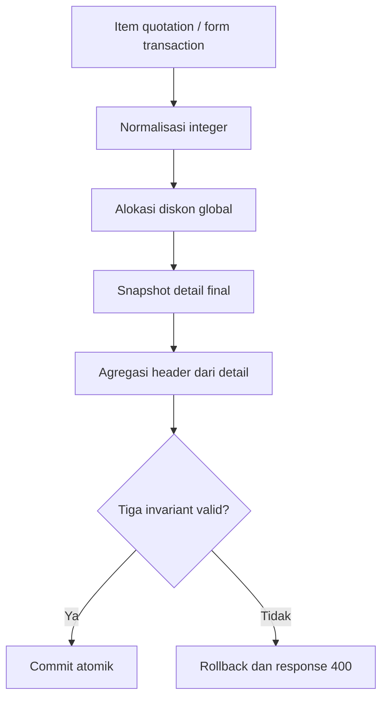
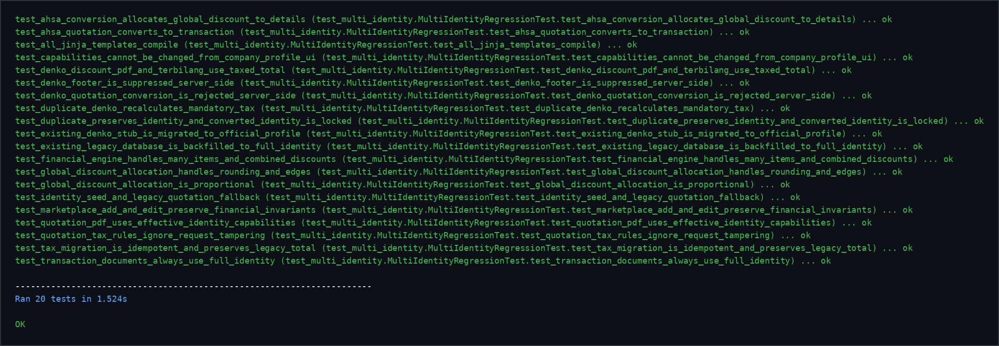

# Sprint 6.2 — Financial Invariant Engine

## 1. Masalah

PR #2 menemukan perbedaan antara nilai header dan snapshot detail setelah
quotation Ahsa dengan diskon global dikonversi menjadi transaction. Contoh
subtotal Rp10.000.000 dengan diskon global Rp1.000.000 menghasilkan header
Rp9.000.000, sedangkan jumlah detail masih Rp10.000.000.

Audit lanjutan menemukan masalah sejenis pada add/edit transaction Marketplace.
Header `margin` sebelumnya dihitung setelah admin fee dan potongan, sementara
`margin_item` hanya menghitung penjualan dikurangi modal. Akibatnya jumlah margin
detail tidak sama dengan margin header.

## 2. Analisis dan akar masalah

Audit mencakup seluruh writer dan consumer nilai penjualan, modal, margin, dan
laba transaction:

| Area | Peran | Temuan |
|---|---|---|
| `add_transaction()` | Writer header dan detail | Rumus margin header berbeda dari detail untuk Marketplace |
| `edit_transaction()` | Writer header dan detail | Memiliki duplikasi rumus yang sama |
| `convert_quotation_to_transaction()` | Writer dari quotation | Diskon global perlu dialokasikan ke snapshot detail |
| `transactions()` | Consumer daftar | Membaca header tersimpan |
| `transaction_detail()` | Consumer detail | Membaca header dan detail tersimpan |
| Invoice, receipt, dan delivery order | Consumer downstream | Menggunakan header transaction; tidak menulis detail finansial |
| Dashboard | Consumer non-finansial saat ini | Tidak memiliki agregasi penjualan/modal/margin |

Akar masalahnya adalah header dan detail dihitung melalui formula terpisah.
Diskon global hanya mengubah header, sedangkan fee Marketplace dimasukkan ke
`margin` header tetapi tidak ke `margin_item`. Tidak ada satu engine yang
memvalidasi hasil sebelum commit database.

## 3. Desain baru

`allocate_global_discount(items, global_discount)` menjadi helper terpusat untuk
alokasi diskon quotation. Setiap hasil item memiliki:

- `subtotal_awal`;
- `diskon_global_alokasi`;
- `subtotal_akhir`;
- `subtotal_modal`;
- `margin_item`.

`calculate_transaction_financials(items, admin_fee, potongan, biaya_lain)`
membentuk seluruh nilai header dari snapshot detail. Helper menolak item bila
`margin_item` tidak sama dengan `subtotal_penjualan - subtotal_modal`, lalu
memvalidasi kembali invariant header sebelum route menulis database.



Semua keputusan finansial berada di server. JavaScript pada form add/edit hanya
menampilkan preview dengan formula yang sama.

## 4. Formula

Semua nominal menggunakan integer rupiah.

```text
subtotal_awal_i = max(
    max(qty_i, 0) × max(harga_satuan_i, 0)
    - max(diskon_item_i, 0),
    0
)

total_base = SUM(subtotal_awal_i)
effective_discount = min(max(diskon_global, 0), total_base)

diskon_global_alokasi_i = floor(
    effective_discount × subtotal_awal_i / total_base
)

subtotal_akhir_i = max(
    subtotal_awal_i - diskon_global_alokasi_i,
    0
)

margin_item_i = subtotal_akhir_i - subtotal_modal_i
```

Sisa hasil pembulatan dibagikan ke subtotal terbesar. Urutan item asli menjadi
tie-breaker deterministik, sehingga alokasi yang sama selalu menghasilkan
snapshot yang sama.

Header dibentuk hanya dari detail:

```text
total_penjualan = SUM(subtotal_penjualan_i)
total_modal = SUM(subtotal_modal_i)
margin = SUM(margin_item_i) = total_penjualan - total_modal

jumlah_diterima = total_penjualan - admin_fee - potongan
laba_bersih = margin - admin_fee - potongan - biaya_lain
```

Dengan definisi ini, `margin` adalah margin kotor item. Admin fee, potongan, dan
biaya lain mengurangi laba bersih. Nilai laba bersih Marketplace tetap sama
dengan formula lama, tetapi header margin kini sama dengan jumlah margin detail.

## 5. Invariant wajib

Sebelum commit transaction baru atau hasil edit/conversion:

```text
SUM(sales_transaction_items.subtotal_penjualan)
    = sales_transactions.total_penjualan

SUM(sales_transaction_items.subtotal_modal)
    = sales_transactions.total_modal

SUM(sales_transaction_items.margin_item)
    = sales_transactions.margin
```

Regression juga membuktikan hubungan `margin = total_penjualan - total_modal`.
Tidak ada toleransi pembulatan; selisih satu rupiah dianggap gagal.

## 6. Edge case

| Kasus | Perilaku server |
|---|---|
| Tidak ada item | Helper alokasi menghasilkan list kosong; conversion menolak quotation tanpa item |
| Satu item | Seluruh diskon efektif dialokasikan ke item tersebut |
| Semua subtotal nol | Tidak ada alokasi dan subtotal akhir tetap nol |
| Diskon global nol | Subtotal akhir sama dengan subtotal awal |
| Diskon melebihi subtotal | Diskon dibatasi sebesar total base; subtotal akhir tidak negatif |
| Subtotal sama | Tie-breaker memakai urutan item asli |
| Sisa rupiah | Dibagikan ke subtotal terbesar secara deterministik |
| Qty/harga nol atau negatif | Dinormalisasi sehingga subtotal awal tidak negatif |
| Diskon item + global | Diskon global dialokasikan setelah diskon item |
| Denko | Tetap ditolak sebelum transaction dibuat |

## 7. Database dan backward compatibility

Tidak ada perubahan schema dan tidak ada migration Sprint 6.2. Engine memakai
kolom existing pada `sales_transactions` dan `sales_transaction_items`.

Data historis tidak diubah otomatis. Transaction baru, hasil edit, dan hasil
conversion setelah hotfix memakai engine baru. Baris historis yang sudah tidak
konsisten memerlukan audit/backfill terpisah setelah backup production; tindakan
tersebut sengaja tidak dilakukan pada PR ini.

## 8. Route, template, dan file berubah

| File | Perubahan |
|---|---|
| `app/main.py` | Helper alokasi dan agregasi terpusat; integrasi add/edit/conversion |
| `app/templates/add_transaction.html` | Preview margin kotor dan laba bersih diselaraskan |
| `app/templates/edit_transaction.html` | Preview margin kotor dan laba bersih diselaraskan |
| `app/templates/transaction_detail.html` | Label `Margin Kotor` |
| `app/templates/transactions.html` | Label `Margin Kotor` |
| `tests/test_multi_identity.py` | Regression helper, conversion, add/edit Marketplace, edge case, dan invariant |
| `SPRINT-6-1-DENKO-PPN-IMPLEMENTATION.md` | Nama helper/output diselaraskan dengan engine final |
| `docs/screenshots/sprint-6-2-regression.png` | Bukti visual hasil regression |

## 9. Regression dan hasil

Perintah verifikasi:

```bash
python -m unittest discover -s tests -p "test_*.py" -v
python -m compileall -q app tests
git diff --check
```

Hasil akhir: **20 test dijalankan, seluruhnya OK**. Skenario mencakup diskon nol,
diskon lebih besar dari subtotal, pembulatan sisa rupiah, satu/dua/banyak item,
diskon item ditambah diskon global, conversion Ahsa, penolakan Denko, add/edit
Marketplace, migrasi Sprint 6.1 idempotent, PDF identity, dan dokumen downstream.



## 10. Risiko dan rollback

Risiko utama adalah perubahan makna tampilan `margin` Marketplace menjadi margin
kotor. `laba_bersih` tetap mengikuti dampak fee/potongan/biaya yang sama. Consumer
eksternal yang sebelumnya menganggap kolom `margin` sebagai nilai setelah fee
perlu memakai `laba_bersih` untuk laba akhir.

Rollback kode dapat dilakukan dengan revert commit Sprint 6.2 karena tidak ada
schema baru. Revert tidak menghapus transaction yang sudah disimpan; data yang
dibuat dengan engine baru tetap memenuhi invariant dan aman dibaca versi lama.

Database production belum disentuh. Backup wajib dilakukan sebelum deployment
atau audit/backfill data historis.

## 11. Commit dan status

Branch: `agent/hotfix-sprint-6-denko-ppn`

Commit final: `fix(finance): preserve transaction financial invariants`

PR: `#2 — Sprint 6.1 Mandatory PPN 11%` (tetap open, belum di-merge).
