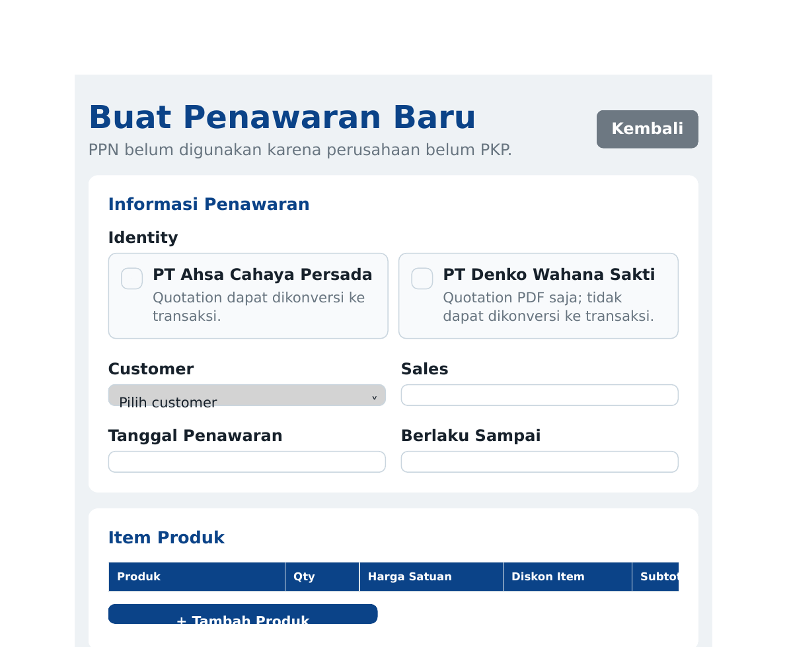
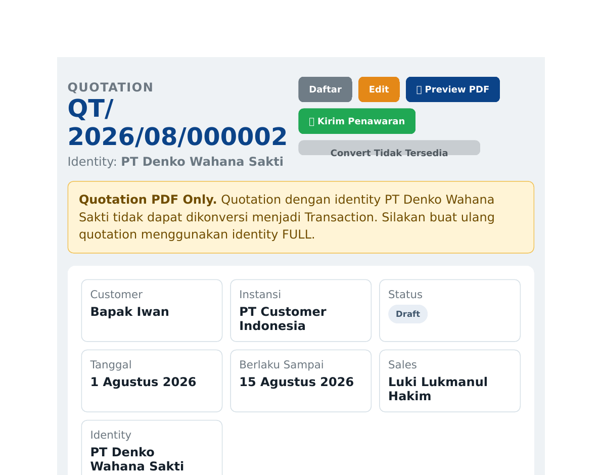
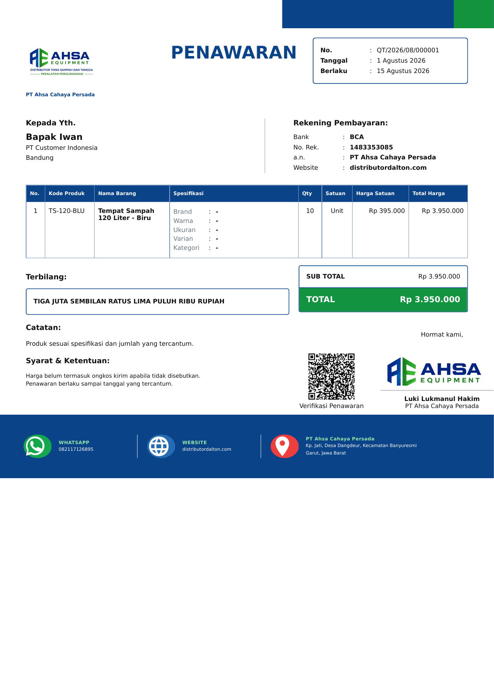
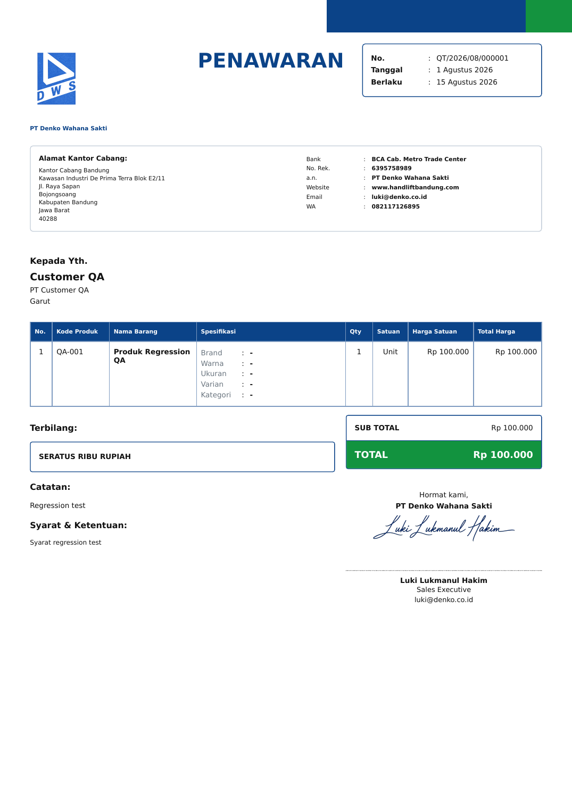

# SPRINT 6 - MULTI IDENTITY IMPLEMENTATION

## Status

- Repository: `lukiahsa/crm-ahsa`
- Baseline: `85e6e0e` (`Initial CRM Ahsa baseline`)
- Branch implementasi: `agent/sprint-6-multi-identity`
- Status regression: **11/11 lulus**
- Status implementasi: profil resmi dan signature Denko telah difinalisasi
- Perubahan pada `main`: tidak ada

## 1. Ringkasan Perubahan

Sprint 6 memperkenalkan konsep company identity sebagai bagian dari domain ERP, bukan sekadar penggantian logo.

`company_identities` sekarang menjadi single source of truth untuk nama perusahaan, alamat, kontak, rekening, logo, footer, signature, dan capability dokumen. Tabel `company_profile` tetap dipertahankan sebagai compatibility layer legacy/deprecated dan hanya dibaca satu kali oleh migration untuk membentuk identity Ahsa pada instalasi lama.

Aturan bisnis yang diterapkan:

- Identity `FULL` adalah identity utama untuk seluruh workflow transaksi.
- Identity `QUOTATION_ONLY` hanya dapat digunakan pada quotation.
- Quotation Ahsa dapat dikonversi menjadi transaction.
- Quotation Denko ditolak oleh server sebelum nomor atau data transaction dibuat.
- Transaction, Invoice, Delivery Order, Receipt, dan Purchase Order selalu menggunakan identity `FULL` utama.
- Capability tidak dapat diubah dari UI.
- Quotation legacy tanpa identity otomatis menggunakan identity `FULL` utama.
- Quotation Ahsa dan Denko menggunakan satu template `quotation_print.html`.
- Identity `QUOTATION_ONLY` selalu menonaktifkan seluruh footer pada server,
  meskipun preference quotation atau request mengirim `show_footer=1`.
- Profil Denko pada header quotation selalu memuat alamat kantor cabang,
  rekening, website, email, dan WhatsApp.
- Denko menggunakan signature milik Denko, tanpa QR, logo Ahsa, signature
  Ahsa, website Ahsa, maupun seluruh elemen footer.

## 2. Struktur Database Baru

### `company_identities`

| Kelompok | Kolom |
|---|---|
| Kunci | `id`, `code`, `identity_type`, `is_default` |
| Profil | `nama_perusahaan`, `nama_brand`, `alamat`, `kota`, `provinsi`, `kode_pos` |
| Kontak | `telepon`, `whatsapp`, `email`, `website`, `npwp` |
| Rekening | `bank`, `no_rekening`, `atas_nama` |
| Asset | `logo_path`, `signature_path`, `signature_name`, `signature_title`, `signature_email` |
| Footer | `footer_invoice`, `footer_quotation`, `footer_purchase_order`, `footer_delivery_order`, `footer_receipt` |
| Capability | `allow_qr`, `allow_signature`, `allow_website_footer`, `allow_transaction_conversion` |
| Lifecycle | `active`, `created_at`, `updated_at` |

Nilai `identity_type` dibatasi oleh SQLite `CHECK`:

- `FULL`
- `QUOTATION_ONLY`

Index unik parsial memastikan hanya ada satu identity default. Capability dan status menggunakan nilai boolean SQLite `0/1` dengan `CHECK` constraint.

### Perubahan `sales_quotations`

Kolom additive:

```sql
identity_id INTEGER
REFERENCES company_identities(id)
ON UPDATE RESTRICT
ON DELETE RESTRICT
```

Database juga menambahkan:

- Index `idx_sales_quotations_identity_id`.
- Trigger fallback setelah insert untuk quotation tanpa identity.
- Trigger fallback setelah update jika `identity_id` menjadi `NULL`.
- Backfill seluruh quotation lama ke identity `FULL` default.

Tidak ada kolom identity pada transaction, invoice, delivery order, receipt, atau purchase order. Pembatasan ini mencegah Denko masuk ke downstream workflow secara struktural.

### Seed Awal

| Code | Identity Type | Default | Logo | Conversion |
|---|---|---:|---|---:|
| `AHSA` | `FULL` | Ya | `images/logo-ahsa.png` | Diizinkan |
| `DENKO` | `QUOTATION_ONLY` | Tidak | `images/denko_logo.png` | Ditolak |

Seed resmi Denko:

| Field | Nilai |
|---|---|
| Nama | `PT Denko Wahana Sakti` |
| Alamat | Kantor Cabang Bandung, Kawasan Industri De Prima Terra Blok E2/11, Jl. Raya Sapan, Bojongsoang, Kabupaten Bandung, Jawa Barat 40288 |
| Website | `https://www.handliftbandung.com` |
| Email | `luki@denko.co.id` |
| WhatsApp | `082117126895` |
| Bank | `BCA Cab. Metro Trade Center` |
| Rekening | `6395758989` a.n. `PT Denko Wahana Sakti` |
| Signature | `images/signature_denko.png` — Luki Lukmanul Hakim, Sales Executive |

Migration mengisi row Denko lama yang masih berupa stub. Kondisi migration
bersifat idempotent dan tidak menimpa profil Denko yang sudah lengkap pada
startup berikutnya.

## 3. Route yang Berubah

| Route | Perubahan |
|---|---|
| `GET /quotations` | Join dan badge identity |
| `GET/POST /quotations/add` | Default Ahsa dan validasi identity aktif |
| `GET/POST /quotations/<id>/edit` | Edit identity; terkunci setelah conversion |
| `GET /quotations/<id>` | Identity dan kelayakan conversion |
| `POST /quotations/<id>/print-settings` | Capability dan `identity_type` server mengalahkan input user; footer `QUOTATION_ONLY` selalu disimpan nonaktif |
| `GET /quotations/<id>/print` | Dynamic identity dan effective print settings |
| `GET /quotations/<id>/whatsapp` | Nama pengirim mengikuti identity quotation |
| `POST /quotations/<id>/duplicate` | Identity sumber dipertahankan |
| `POST /quotations/<id>/convert` | `QUOTATION_ONLY` ditolak HTTP 400 |
| Transaction add/edit/detail/print | Identity `FULL` melalui helper |
| Invoice generate/edit/print | Identity `FULL` melalui helper |
| Delivery Order generate/print | Identity `FULL` melalui helper |
| Receipt add/print | Identity `FULL` melalui helper |
| Purchase Order add/print | Identity `FULL` melalui helper |
| `GET/POST /settings/company` | Membaca/menulis `company_identities` |

Helper pusat:

```python
get_effective_identity(document_type, quotation_id=None)
```

Helper tersebut menentukan identity quotation atau identity `FULL` default untuk dokumen transaksi. Tidak ada pemeriksaan nama perusahaan di route.

Pesan penolakan server:

> Quotation Denko tidak dapat dikonversi menjadi Transaction. Silakan buat ulang Quotation menggunakan Identity Ahsa.

## 4. Template yang Berubah

- `add_quotation.html`
- `edit_quotation.html`
- `quotations.html`
- `quotation_detail.html`
- `quotation_print.html`
- `transaction_print.html`
- `invoice_print.html`
- `delivery_order_print.html`
- `receipt_print.html`
- `purchase_order_print.html`
- `company_profile_settings.html`
- `settings_home.html`

`quotation_print.html` tetap menjadi satu-satunya template quotation. Identity menentukan logo, nama perusahaan, rekening, email, website, footer, QR, dan signature.

Untuk Denko, server memastikan:

- `denko_logo.png` digunakan.
- QR tidak dibuat.
- `www.handliftbandung.com`, email, WhatsApp, alamat, dan rekening Denko
  dirender pada blok identitas di bagian atas dokumen.
- `signature_denko.png` dirender bersama nama, jabatan, dan email Denko.
- Signature dan logo Ahsa tidak dirender.
- Logo/nama Ahsa tidak dirender.
- Seluruh elemen `<footer>` tidak dirender.

Asset baru:

- `app/static/images/signature_denko.png`: PNG RGBA transparan, tinta biru
  tua, dibuat khusus untuk signature Luki Lukmanul Hakim.

## 5. Screenshot Alur Identity

### Pilihan Identity pada Form Quotation



### Denko Tidak Dapat Dikonversi



### Quotation Ahsa



### Quotation Denko



Screenshot dirender dari response HTML aktual Flask menggunakan database QA sementara. Database production/repository tidak digunakan untuk data screenshot.

## 6. QA Checklist

- [x] Seed Ahsa `FULL` dan Denko `QUOTATION_ONLY`.
- [x] Migration dapat dijalankan berulang kali.
- [x] Quotation lama di-backfill ke Ahsa.
- [x] Default form quotation adalah Ahsa.
- [x] Identity ID invalid/inactive ditolak server.
- [x] Ahsa dapat dikonversi menjadi transaction.
- [x] Denko ditolak sebelum transaction dibuat.
- [x] Duplicate quotation mempertahankan identity.
- [x] Identity quotation terkunci setelah conversion.
- [x] Manipulasi capability melalui settings POST diabaikan.
- [x] QR Denko tetap nonaktif meskipun request dimanipulasi.
- [x] Signature resmi Denko muncul tanpa signature atau logo Ahsa.
- [x] Website `handliftbandung.com`, alamat, rekening, email, dan WA Denko
  muncul pada header identity.
- [x] Footer Denko tetap tidak dirender meskipun request dan data legacy
  memiliki `show_footer=1`.
- [x] Footer Ahsa tetap mengikuti preference quotation.
- [x] Invoice selalu Ahsa.
- [x] Delivery Order selalu Ahsa.
- [x] Receipt selalu Ahsa.
- [x] Purchase Order selalu Ahsa.
- [x] Transaction print selalu Ahsa.
- [x] Seluruh 45 template Jinja dapat dikompilasi.
- [x] SQLite `PRAGMA integrity_check` menghasilkan `ok`.
- [x] Asset logo existing tidak diubah.

## 7. Regression Result

Perintah:

```bash
python -m unittest discover -s tests -p 'test_*.py' -v
```

Hasil:

```text
Ran 11 tests
OK
```

Test suite: `tests/test_multi_identity.py`.

Skenario otomatis:

1. Ahsa quotation berhasil dikonversi.
2. Denko quotation ditolak server.
3. Ahsa PDF berisi logo, website, QR, dan signature Ahsa.
4. Denko PDF berisi logo, profil resmi, rekening, website, dan signature
   Denko; tanpa QR, logo Ahsa, atau signature Ahsa.
5. Invoice selalu identity FULL.
6. Delivery Order selalu identity FULL.
7. Receipt selalu identity FULL.
8. Purchase Order dan transaction print selalu identity FULL.
9. Manipulasi `show_footer=1` pada Denko tetap tidak merender elemen
   `<footer>`, website Ahsa, QR, logo Ahsa, atau signature Ahsa; profil dan
   signature resmi Denko tetap tampil serta footer Ahsa tetap tampil.
10. Row seed Denko lama yang masih stub dimigrasikan secara idempotent ke
    profil resmi.
11. Migration legacy, duplicate, lock identity, capability tampering, dan Jinja compilation.

## 8. Commit yang Dibuat

| Commit | Message |
|---|---|
| `cb1a8f6` | `feat(identity): add company identity foundation` |
| `64c89e8` | `feat(identity): enforce server-side document rules` |
| `2b55e2b` | `feat(identity): render dynamic company identities` |
| `9be5d2e` | `test(identity): cover multi-identity regression paths` |
| `5977c3c` | `fix(identity): polish identity document layouts` |
| Dokumentasi | `docs(sprint-6): add implementation report` |
| Revisi wajib | `fix(identity): suppress all footer content for Denko quotations` |
| Finalisasi profil Denko | `fix(identity): finalize official Denko identity profile` |

## 9. Langkah Merge dan Deployment

### Review branch

```bash
git fetch origin
git switch agent/sprint-6-multi-identity
git pull --ff-only
python -m unittest discover -s tests -p 'test_*.py' -v
```

### Backup database sebelum deployment

Buat salinan aman `database/crm.db` sebelum aplikasi versi Sprint 6 dijalankan. Migration berjalan saat aplikasi melakukan startup.

### Merge ke main setelah approval

```bash
git switch main
git pull --ff-only origin main
git merge --no-ff agent/sprint-6-multi-identity
python -m unittest discover -s tests -p 'test_*.py' -v
git push origin main
```

### Verifikasi setelah startup

1. Pastikan tabel `company_identities` berisi tepat satu default `FULL`.
2. Pastikan quotation lama memiliki `identity_id` Ahsa.
3. Buat satu quotation Ahsa dan lakukan conversion.
4. Buat satu quotation Denko dan pastikan conversion mendapat HTTP 400.
5. Periksa visual Invoice, DO, Receipt, dan PO tetap Ahsa.
6. Pastikan header Denko menampilkan profil resmi dan signature Denko tanpa
   QR maupun elemen `<footer>`.

## Risiko Tersisa

- Profil identity belum menggunakan versioning/snapshot. Perubahan profil dapat memengaruhi hasil reprint dokumen lama.
- Profil identity belum memiliki histori perubahan terpisah. Karena migration
  profil Denko hanya mengisi row stub, perubahan manual berikutnya tidak
  ditimpa saat startup.
- Repository baseline masih belum memiliki authentication, authorization, dan CSRF protection. Hal tersebut tetap menjadi blocker deployment publik dan harus ditangani pada sprint keamanan terpisah.
