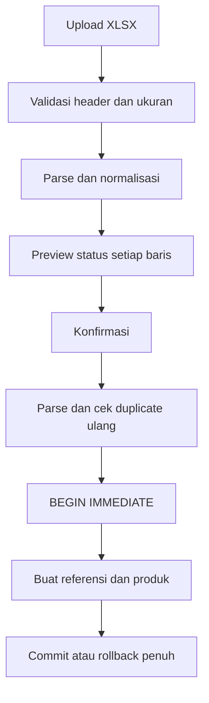

# Sprint 7 — Import Master Produk Existing

## Ringkasan

Sprint ini menambahkan import master produk resmi melalui `/products/import` dengan alur upload, parsing, preview, validasi, deteksi duplicate, dan konfirmasi import atomik. File sumber tidak disimpan di repository dan tidak ada data dummy atau harga hasil asumsi.

Source yang diaudit:

- Nama: `MASTER PRODUK.xlsx`
- SHA-256: `8ff6f0ba52316b0626854533e923078b16affc57b2d6ef76861ce37015dd1f9b`
- Sheet: `Sheet1`
- Layout: tiga tabel berdampingan pada kolom `B:E`, `G:M`, dan `O:Q`

## Hasil Parsing File Resmi

| Kelompok | Jumlah produk | Harga modal kosong | Error | Duplicate dalam file |
|---|---:|---:|---:|---:|
| Tempat Sampah | 69 | 0 | 0 | 0 |
| Tangga | 115 | 0 | 0 | 0 |
| Material Handling | 100 | 100 | 0 | 0 |
| **Total** | **284** | **100** | **0** | **0** |

Preview terhadap database kosong menghasilkan 184 baris `valid`, 100 baris `warning`, 0 `duplicate`, dan 0 `error`. Jumlah yang benar-benar dibuat di database operasional dapat lebih kecil apabila preview menemukan produk existing.

Seluruh harga kosong berasal dari Material Handling. Nilai tersebut disimpan sebagai `0` karena schema existing mewajibkan `harga_modal_default INTEGER NOT NULL DEFAULT 0`, dan setiap baris tetap diberi warning pada preview.

## Mapping dan Normalisasi

### Tempat Sampah

| Sumber | Tujuan |
|---|---|
| Nama Produk | basis `nama_produk` |
| Kapasitas | `variant` dan bagian nama |
| Warna | master warna dan akhiran nama |
| Harga Modal | `harga_modal_default` |
| Konstanta | kategori `Tempat Sampah`, brand `Dalton`, satuan `Unit` |

SKU dibuat deterministik dan disimpan sebagai `kode_produk`, misalnya `TS-025-PEDAL-KUNING`. Untuk kapasitas non-liter, token sumber tetap dipertahankan dalam slug SKU.

### Tangga

| Sumber | Tujuan |
|---|---|
| Nama Produk + Jenis Produk + Tipe Produk | `nama_produk` |
| Merk | master brand |
| Jenis Produk | `jenis_produk` |
| Tipe Produk | `kode_produk` |
| Ukuran | master ukuran |
| Steps | `steps` |
| Harga Modal | `harga_modal_default` |
| Konstanta | kategori `Tangga`, satuan `Unit` |

Kode, ukuran, merk, dan format Steps seperti `2x6`, `4x4`, maupun angka biasa dipertahankan.

### Material Handling

| Sumber | Tujuan |
|---|---|
| Nama Produk | `subkategori` dan bagian nama |
| Tipe | `kode_produk` dan bagian nama |
| Harga Modal | `harga_modal_default`, atau `0` dengan warning bila kosong |
| Konstanta | kategori `Material Handling`, satuan `Unit`, brand kosong |

Normalisasi hanya melakukan trim, menghapus spasi ganda, mengubah sel kosong menjadi `NULL`, dan mengubah nominal integral menjadi integer Rupiah. Tidak ada perubahan makna nama dan tidak ada perhitungan nominal dengan float.

## Forward-fill

Workbook menggunakan merged cell untuk Nama Produk, Kapasitas, Merk, Jenis Produk, dan subkategori. Parser membaca nilai terakhir yang eksplisit pada kelompok/kolom yang sama dan meneruskannya ke baris detail berikutnya. Nilai detail seperti warna, tipe, ukuran, Steps, dan harga tidak di-forward-fill kecuali memang merupakan identitas kelompok yang di-merge.

## Perubahan Schema

Tiga kolom nullable ditambahkan secara additive pada `products`:

| Kolom | Tipe | Tujuan |
|---|---|---|
| `subkategori` | `TEXT NULL` | Menjaga klasifikasi Material Handling |
| `jenis_produk` | `TEXT NULL` | Menjaga Jenis Produk Tangga |
| `steps` | `TEXT NULL` | Menjaga format Steps asli |

Migration menggunakan `ensure_column()`, idempotent, tidak menghapus kolom existing, dan tidak mengubah produk historis.

## Workflow Server-side



Konfirmasi membawa salinan file preview dan SHA-256. Server memverifikasi digest, mem-parse ulang XLSX, dan mengecek ulang duplicate terhadap database sebelum membuka transaksi tulis. JavaScript hanya digunakan untuk mengunduh laporan Markdown setelah import; keputusan validasi dan import seluruhnya berada di server.

## Duplicate Rules

Prioritas deteksi:

1. `kode_produk`/SKU, case-insensitive.
2. Kode yang sama dengan nama berbeda diklasifikasikan `code_name_conflict`.
3. Kombinasi `nama_produk + brand + variant + ukuran + warna`.

Kategori hasil adalah `existing_database`, `duplicate_in_file`, atau `code_name_conflict`. Semua duplicate selalu `SKIP`; implementasi tidak menyediakan overwrite tersembunyi.

## File dan Fungsi yang Berubah

| File | Perubahan utama |
|---|---|
| `app/product_import.py` | parser, normalisasi, SKU, validasi, duplicate analysis, referensi, dan transaction import |
| `app/database.py` | migration additive `subkategori`, `jenis_produk`, `steps` |
| `app/main.py` | `decode_product_import_payload()`, `build_product_import_report()`, route `import_products()` |
| `app/templates/product_import.html` | upload, preview, ringkasan, confirm, dan download laporan |
| `app/templates/products.html` | tombol Import XLSX, field baru, dan alias reference yang sesuai query |
| `tests/test_product_import.py` | regression parser, duplicate, rollback, idempotensi, route, dan rendering |

## Regression

Perintah:

```bash
python -m unittest discover -s tests -p "test_*.py" -v
python -m compileall -q app tests
git diff --check
```

Hasil final: 37 test lulus, termasuk 20 regression Sprint 6 dan 17 test import produk.

Coverage import mencakup tiga kelompok, forward-fill, integer Rupiah, harga kosong, SKU deterministik, harga negatif, duplicate file/database, konflik kode-nama, rollback fatal, import dua kali, integritas payload preview, migration idempotent, dan halaman produk.

## Risiko

- Database production dapat mempunyai duplicate yang tidak terlihat pada preview database kosong; user wajib meninjau preview pada environment target.
- Seratus Material Handling belum mempunyai harga modal resmi dan akan bernilai `0` sampai diperbarui melalui data resmi berikutnya.
- Import berhasil tidak mempunyai auto-delete batch. Backup database adalah jalur rollback paling aman.
- Endpoint mengikuti kontrol akses aplikasi existing; penambahan authentication/CSRF berada di luar scope sprint ini.
- File dengan layout berbeda ditolak agar tidak terjadi mapping diam-diam yang salah.

## Rollback dan Operasional

1. Jangan menguji pada database production sebelum backup file SQLite.
2. Jalankan `PRAGMA integrity_check` pada salinan backup.
3. Preview file dan simpan laporan sebelum menekan Konfirmasi Import.
4. Kegagalan fatal saat import otomatis menjalankan rollback seluruh referensi dan produk dalam transaksi tersebut.
5. Jika import sukses harus dibatalkan, hentikan aplikasi dan pulihkan backup SQLite; jangan menghapus produk berdasarkan asumsi.
6. Rollback kode dilakukan dengan revert commit Sprint ini. Kolom additive dapat dibiarkan karena nullable dan backward-compatible.

## Commit Implementasi

- `6ad2011` — `feat(product): add normalized XLSX import engine`
- `4c18be6` — `feat(product): add import preview and confirmation workflow`
- `9fdcde5` — `test(product): cover master product import workflow`

Branch tidak di-merge ke `main` sebelum review.
