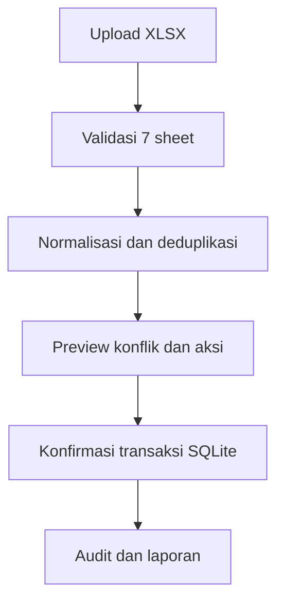

# Sprint 8 — Import Master Database Customer Existing

## 1. Ringkasan

Sprint 8 menambahkan workflow import customer resmi melalui `GET/POST /customers/import`: upload XLSX, validasi tujuh sheet, normalisasi, deduplikasi lintas sheet dan database, preview konflik, lalu konfirmasi import dalam satu transaksi SQLite.

Implementasi mempertahankan schema dan route customer lama. Field legacy `nama`, `whatsapp`, `instansi`, `produk`, `sumber`, dan `status` tetap digunakan oleh modul ERP existing. Metadata sumber dan audit import ditambahkan secara additive.

File sumber tidak disimpan ke repository. Verifikasi sumber yang dipakai pada dry-run:

- Nama: `MASTER DATABASE FINAL.xlsx`
- SHA-256: `7320fd752952a3044f917cf6fa822a0ce1786e3b856cde5c3ce331fae7942e26`
- Total baris data: 4.958
- Formula Excel: tidak ada
- Seluruh nomor pada workbook resmi terbaca sebagai teks, bukan float

Database production tidak dibuka, tidak dimigrasikan, dan tidak diisi pada implementasi ini. Seluruh dry-run memakai database SQLite sementara.

## 2. Sheet Sumber dan Mapping

| Sheet | Baris | Status | Minat / mapping utama |
|---|---:|---|---|
| Customer Tempat Sampah | 314 | Prospek | Tempat Sampah |
| Customer Tangga | 59 | Prospek | Tangga |
| Customer MH | 1.994 | Prospek | Material Handling |
| Belum Terklasifikasi | 2.206 | Prospek | NULL kecuali satu keyword produk yang tidak ambigu |
| Existing Produk Tempat Sampah | 263 | Existing Customer | Tempat Sampah |
| Existing Produk Tangga | 42 | Existing Customer | Tangga |
| Existing Produk MH | 80 | Existing Customer | PIC, WA, perusahaan, produk dibeli, email, alamat |
| **Total** | **4.958** |  |  |

Mapping dua kolom:

- `Nama` → `nama_asli`, `nama`, dan turunan `nama_normalisasi`
- `Nomor WhatsApp` → `whatsapp_raw`, serta `whatsapp`/`whatsapp_normalized` hanya jika valid
- nama sheet → `sumber`
- kelompok produk sheet → `produk`

Mapping Existing Produk MH:

- `Nama PIC` → nama customer/PIC
- `Kontak WA` → WhatsApp sumber dan hasil normalisasi
- `Perusahaan` → `instansi`
- `Produk Dibeli` → `produk_existing`; minat ditentukan hanya dari keyword yang jelas
- `Email` → `email_raw`; `email` hanya jika format valid
- `Alamat` → `alamat`

## 3. Normalisasi

### WhatsApp

Normalisasi dilakukan server-side tanpa float:

1. trim dan hapus spasi, `+`, `-`, `(`, `)`;
2. awalan `0` diubah menjadi `62`;
3. awalan `62` dipertahankan;
4. hasil valid harus digit, berawalan `628`, dan panjang 10–15 digit;
5. nilai yang tidak pasti tidak ditebak dan tidak disimpan sebagai nomor valid;
6. nilai sumber selalu dipertahankan pada `whatsapp_raw`.

### Nama dan email

- Spasi awal/akhir dan spasi ganda dibersihkan.
- `nama_asli` mempertahankan teks sumber yang telah di-trim.
- `nama_normalisasi` membuang simbol/emoji pencarian dan keyword produk yang berdiri sendiri, tetapi tidak mengganti ejaan.
- Nama kosong dengan WhatsApp valid memakai nomor sebagai identifier tampilan legacy karena kolom `customers.nama` existing bersifat `NOT NULL`; tidak ada nama yang dikarang.
- Email disimpan lowercase pada `email` hanya jika lolos validasi. Teks sumber tetap ada di `email_raw`.

### Klasifikasi produk

Sheet yang sudah terklasifikasi selalu menjadi sumber utama. Keyword hanya membantu metadata pada `Belum Terklasifikasi` dan `Produk Dibeli`. Jika tidak ada satu kategori yang jelas, nilai tetap `Belum Terklasifikasi`.

## 4. Deduplikasi dan Merge

Urutan identifier:

1. `whatsapp_normalized`;
2. email valid yang sudah dinormalisasi;
3. kombinasi `nama_normalisasi + instansi`, hanya jika keduanya tersedia.

Union-find dipakai untuk menggabungkan duplicate secara transitif lintas tujuh sheet. Hasil gabungan:

- satu customer untuk identifier yang sama;
- sumber dan minat digabung secara deterministik;
- `Existing Customer` mengalahkan `Prospek`;
- informasi terlengkap dipertahankan;
- konflik nilai berbeda ditampilkan pada preview;
- field database berisi tidak ditimpa nilai kosong;
- `produk`, `sumber`, dan metadata sumber digabung non-destruktif;
- SHA-256 batch mencegah file identik diimport ulang, termasuk record tanpa identifier deduplikasi yang cukup kuat.

## 5. Alur Server



Preview tidak menulis database. Pada konfirmasi, server memverifikasi ulang SHA-256, melakukan parse dan deduplikasi ulang, mengambil lock `BEGIN IMMEDIATE`, lalu menjalankan CREATE/MERGE/SKIP. Error runtime menyebabkan rollback batch, customer, dan audit trail sekaligus.

Baris yang gagal validasi minimum nama/WhatsApp dicatat sebagai error sumber dan dikeluarkan dari kandidat import; nilai sumber tidak diperbaiki berdasarkan asumsi.

## 6. Perubahan Database

Migration dijalankan oleh `create_tables()` dan idempotent.

Kolom additive pada `customers`:

| Kolom | Tipe | Fungsi |
|---|---|---|
| nama_asli | TEXT | Nama sumber setelah trim |
| nama_normalisasi | TEXT | Kunci pencarian/deduplikasi nama |
| whatsapp_raw | TEXT | Nomor sumber tanpa kehilangan teks |
| whatsapp_normalized | TEXT | Nomor valid format `628…` |
| email_raw | TEXT | Email sumber |
| email | TEXT | Email tervalidasi dan lowercase |
| alamat | TEXT | Alamat resmi sumber |
| produk_existing | TEXT | Produk yang tercatat pernah dibeli |
| klasifikasi_produk | TEXT | Klasifikasi atau Belum Terklasifikasi |
| import_batch_id | TEXT | Batch asal untuk customer baru |
| updated_at | TIMESTAMP | Waktu update hasil merge |

Tabel baru:

- `customer_import_batches`: file hash, rekap, status hasil, dan laporan Markdown per batch.
- `customer_import_changes`: aksi per customer, metode match, baris sumber, field berubah, serta JSON before/after. Tabel ini menjadi audit trail CREATE/MERGE/SKIP.

Tidak ada kolom existing yang dihapus atau diubah. Tidak ada migration yang dijalankan pada database production.

## 7. Hasil Parsing File Resmi

| Metrik | Hasil |
|---|---:|
| Total baris sumber | 4.958 |
| Nomor WhatsApp valid | 4.883 |
| Customer unik siap import | 4.608 |
| Existing Customer | 369 |
| Prospek | 4.239 |
| Belum Terklasifikasi | 2.042 |
| Duplicate dalam file | 348 |
| Duplicate lintas sheet | 348 |
| Duplicate database repository | 0 |
| Baris warning | 75 |
| Baris error | 2 |

`Duplicate database repository = 0` berasal dari database sementara kosong karena repository tidak memuat database runtime. Nilai aktual wajib dilihat kembali pada preview setelah memakai salinan database operasional yang sudah di-backup.

Warning utama:

- 73 baris memiliki nomor yang tidak disimpan sebagai nomor valid;
- 31 nomor bukan seluler Indonesia berawalan `628`;
- 22 nomor memiliki panjang di luar 10–15 digit;
- 20 nomor tidak diawali `0` atau `62`;
- 2 nama kosong;
- 2 nomor WhatsApp kosong.

Satu baris dapat memiliki lebih dari satu warning. Dua baris error tidak memiliki nama dan juga tidak memiliki nomor WhatsApp yang dapat divalidasi; keduanya tetap muncul pada laporan error dan tidak diimport.

Dry-run import database sementara menghasilkan:

- 4.608 customer dibuat;
- 4.608 audit action dibuat;
- `PRAGMA integrity_check` = `ok`;
- `PRAGMA foreign_key_check` = tanpa pelanggaran;
- import kedua dengan file identik membuat 0 customer dan melewati 4.608 customer.

## 8. File dan Route yang Berubah

| File | Perubahan |
|---|---|
| `app/customer_import.py` | Parser, normalisasi, klasifikasi, deduplikasi, database matching, transaction engine, audit, laporan |
| `app/database.py` | Migration customer additive dan dua tabel audit import |
| `app/main.py` | Route `/customers/import`, verifikasi payload/SHA, perluasan pencarian customer |
| `app/templates/customer_import.html` | Upload, KPI preview, rekap sheet, konflik, konfirmasi, hasil, download laporan |
| `app/templates/customers.html` | Tombol menuju import customer |
| `tests/test_customer_import.py` | 18 regression test Sprint 8 |
| `SPRINT-8-MASTER-CUSTOMER-IMPORT.md` | Dokumentasi implementasi dan hasil dry-run |

Route baru:

- `GET /customers/import` — form upload.
- `POST /customers/import` dengan `action=preview` — parse dan preview tanpa write.
- `POST /customers/import` dengan `action=confirm` — verifikasi ulang dan import atomik.

Route `GET /customers` diperluas agar pencarian mencakup WhatsApp normalisasi, email, dan produk existing. Workflow create/edit/delete lama tidak diubah.

## 9. Regression

Test Sprint 8 mencakup:

- parsing seluruh tujuh sheet, dua kolom, dan Existing Produk MH;
- format `08`, `+62`, spasi/tanda baca, serta nomor invalid;
- duplicate lintas sheet dan duplicate database;
- prioritas Existing Customer;
- penggabungan minat dan data terlengkap;
- email invalid;
- import dua kali;
- rollback fatal;
- Belum Terklasifikasi;
- migration idempotent;
- preview route tidak menulis database.

Hasil final:

```text
Ran 38 tests
OK
```

Validasi tambahan:

```text
python -m compileall -q app tests    OK
git diff --check                    OK
```

## 10. Risiko

- Dua baris sumber tidak dapat diimport karena melanggar validasi minimum; koreksi hanya boleh dilakukan user pada file resmi.
- Sebanyak 73 baris tidak mempunyai nomor WhatsApp valid tetapi masih dapat menjadi customer jika nama tersedia; follow-up berdasarkan WA tidak tersedia untuk record tersebut.
- Deduplikasi tanpa nomor/email hanya memakai nama + perusahaan. Nama saja sengaja tidak dipakai agar customer berbeda dengan nama umum tidak tergabung.
- Keyword hanya metadata; klasifikasi bisnis masih perlu review untuk 2.042 customer unik yang tetap Belum Terklasifikasi.
- Merge pasca-commit mengubah field kosong/status/minat/sumber secara non-destruktif. Backup database tetap wajib karena rollback bisnis otomatis pasca-commit belum disediakan sebagai tombol UI.
- Authentication dan CSRF mengikuti kondisi aplikasi existing dan berada di luar scope Sprint 8.

## 11. Rollback dan Uji Lokal

Sebelum uji pada data operasional:

1. hentikan write aplikasi;
2. salin file SQLite dan file `-wal`/`-shm` bila ada;
3. jalankan `PRAGMA integrity_check` pada backup;
4. uji migration dan preview pada salinan database;
5. ekspor laporan preview dan review dua baris error serta konflik;
6. baru jalankan konfirmasi pada salinan lokal.

Jika error terjadi sebelum commit, server otomatis melakukan rollback penuh. Jika rollback diperlukan setelah commit, pulihkan backup SQLite yang telah diverifikasi. `customer_import_changes` menyediakan before/after untuk audit dampak, tetapi backfill/reversal SQL otomatis tidak dijalankan pada sprint ini.

Rollback kode dilakukan dengan revert commit Sprint 8 pada branch; migration additive dapat dibiarkan tanpa memengaruhi workflow lama.

## 12. Commit dan Status

Commit branch Sprint 8:

- `feat(customer): add atomic master customer import engine`
- `feat(customer): add customer import preview workflow`
- `test(customer): cover customer import regression and documentation`

Branch: `agent/sprint-8-import-master-customer`. Pull Request disiapkan sebagai draft dan tidak di-merge tanpa approval Technical Lead.
