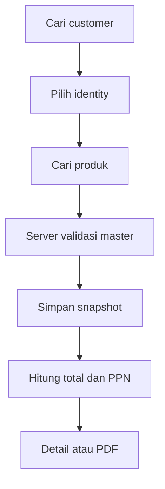

# Sprint 9 — Master Customer & Master Product Integration

## Ringkasan

Sprint 9 mengubah Quotation Engine agar pembuatan dan perubahan quotation memakai master customer serta master produk yang sudah tersedia dari Sprint 7 dan Sprint 8. Browser hanya mengirim ID; server memvalidasi record master, membentuk snapshot, menghitung seluruh nominal, dan menerapkan aturan identity/PPN existing.

Implementasi tidak mengubah aturan berikut:

- Ahsa adalah identity `FULL`, tanpa PPN, dan tetap dapat dikonversi menjadi transaction.
- Denko adalah identity `QUOTATION_ONLY`, wajib PPN 11%, dan tetap tidak dapat dikonversi.
- Financial Invariant Engine tetap menjadi sumber perhitungan conversion.
- Database production dan migration production tidak dijalankan dalam Sprint ini.

## Audit dan Akar Masalah

Sebelum perubahan, quotation sudah mempunyai `customer_id` dan item sudah mempunyai `product_id`, tetapi beberapa bagian masih membaca data master secara langsung ketika detail/PDF dibuka. Form tambah/edit juga memuat seluruh customer dan produk ke HTML. Akibatnya:

- perubahan master dapat mengubah tampilan dokumen historis;
- halaman akan semakin berat saat master berisi ribuan record;
- nama customer/produk dari request belum seluruhnya diverifikasi terhadap master;
- snapshot spesifikasi produk belum menyimpan subkategori, jenis produk, Steps, dan harga modal internal;
- duplicate quotation belum dapat mempertahankan semua snapshot baru.

## Alur Baru



Autocomplete mulai bekerja setelah dua karakter dan maksimal mengembalikan 20 record. Form tidak memuat seluruh master ke browser.

## Endpoint Baru

| Method | Endpoint | Fungsi |
|---|---|---|
| `GET` | `/api/customers/search?keyword=...&limit=...` | Pencarian nama, perusahaan, WhatsApp, email, kota, dan status customer |
| `GET` | `/api/products/search?keyword=...&limit=...` | Pencarian kode/SKU, nama, kategori, subkategori, brand, varian, warna, ukuran, jenis produk, dan Steps |

Query memakai parameter SQL, batas hasil dinormalisasi server, dan record inactive tidak dikembalikan.

## Mapping Snapshot Customer

| Master customer | Snapshot quotation |
|---|---|
| `nama` | `customer_nama_snapshot` |
| `instansi` | `customer_perusahaan_snapshot` |
| `nama` | `customer_pic_snapshot` |
| `nomor_kontak`/`whatsapp_normalized` | `customer_whatsapp_snapshot` |
| `email` | `customer_email_snapshot` |
| `alamat` | `customer_alamat_snapshot` |
| `kota` | `customer_kota_snapshot` |
| `status_customer` | `customer_status_snapshot` |
| `minat_produk` | `customer_minat_snapshot` |

Kolom `customer_id` tetap menjadi relasi ke master. Detail dan PDF memakai snapshot; quotation legacy yang snapshot-nya kosong memakai fallback master secara backward-compatible.

## Mapping Snapshot Produk

Snapshot existing seperti kode, nama, kategori, brand, varian, warna, ukuran, dan satuan tetap digunakan. Sprint 9 menambahkan:

| Kolom | Tujuan |
|---|---|
| `subkategori_snapshot` | Snapshot subkategori produk |
| `jenis_produk_snapshot` | Snapshot jenis produk |
| `steps_snapshot` | Snapshot Steps dengan format sumber |
| `spesifikasi_snapshot` | Teks spesifikasi final tanpa baris kosong |
| `harga_modal_snapshot` | Harga modal internal saat quotation dibuat |

Harga modal snapshot tidak ditampilkan pada PDF customer. Untuk quotation baru, conversion memakai harga modal snapshot agar perubahan master tidak mengubah margin historis. Quotation legacy dengan snapshot modal `NULL` tetap memakai fallback master.

## Spesifikasi Otomatis

Helper membentuk baris hanya untuk nilai yang tersedia:

- Brand
- Kategori
- Subkategori
- Jenis
- Varian
- Warna
- Ukuran
- Steps

Nilai kosong tidak menghasilkan label, pemisah, atau baris kosong. Snapshot disimpan sebagai teks pada setiap item quotation.

## Validasi Server-side

Server menolak:

- customer tidak ditemukan atau inactive;
- produk tidak ditemukan atau inactive;
- identity tidak valid;
- quotation tanpa item;
- `qty <= 0`;
- harga jual negatif;
- diskon item negatif;
- diskon global negatif.

Nama customer, data produk, harga modal, identity type, status PPN, dan tarif PPN tidak dipercaya dari browser. JavaScript hanya menangani pencarian dan preview perhitungan.

## Perhitungan

Semua nominal diproses sebagai integer Rupiah:

```text
subtotal_item = max(qty * harga_jual - diskon_item, 0)
subtotal      = SUM(subtotal_item)
dpp           = max(subtotal - diskon_global, 0)
ppn_denko     = round_integer(11% * dpp)
total_ahsa    = dpp
total_denko   = dpp + ppn_denko
```

Request `is_ppn` dan `ppn_rate` tidak menentukan hasil. Helper identity/tax existing tetap menjadi sumber kebenaran.

## Duplicate dan Edit

- Duplicate mempertahankan `customer_id`, `product_id`, snapshot customer, dan snapshot setiap item.
- Nomor quotation baru tetap dibuat oleh workflow existing.
- Total dan PPN dihitung ulang sesuai identity.
- Edit memvalidasi ulang master yang dipilih dan membuat snapshot terbaru untuk versi dokumen yang disimpan.

## Perubahan Schema

Migration bersifat additive dan idempotent:

- `customers.status_aktif INTEGER NOT NULL DEFAULT 1`;
- sembilan kolom snapshot customer pada `sales_quotations`;
- lima kolom snapshot produk pada `sales_quotation_items`;
- index pencarian customer dan produk.

Tidak ada kolom yang dihapus, diubah tipenya, atau di-backfill secara destruktif.

## File dan Fungsi yang Berubah

| File | Perubahan utama |
|---|---|
| `app/database.py` | Migration additive, snapshot, status aktif, dan index pencarian |
| `app/quotation_master.py` | Helper pencarian, validasi master, snapshot, dan spesifikasi |
| `app/main.py` | Endpoint search, add/edit/detail/print/duplicate/conversion terintegrasi master |
| `app/static/js/quotation_form.js` | Autocomplete dan preview bersama untuk add/edit |
| `app/templates/add_quotation.html` | Selector customer/produk AJAX |
| `app/templates/edit_quotation.html` | Selector AJAX dengan snapshot existing |
| `app/templates/quotation_detail.html` | Customer dan spesifikasi snapshot |
| `app/templates/quotation_print.html` | PDF/print dari snapshot |
| `tests/test_quotation_master_integration.py` | Regression Sprint 9 |

Fungsi utama baru/berubah:

- `search_customers()` dan `search_products()`;
- `prepare_quotation_customer()`;
- `get_quotation_with_customer_snapshot()`;
- `insert_quotation_items()`;
- route add, edit, detail, print, duplicate, WhatsApp, dan convert quotation.

## Regression

Perintah:

```bash
python -m unittest discover -s tests -p "test_*.py" -v
python -m compileall -q app tests
node --check app/static/js/quotation_form.js
git diff --check
```

Hasil implementasi sebelum dokumentasi: **81 test lulus** (`Ran 81 tests`, `OK`). Dari jumlah tersebut, 25 test mencakup integrasi master quotation dan 56 test mempertahankan regression Sprint sebelumnya.

Coverage Sprint 9 meliputi pencarian semua field, batas 20 record, snapshot customer/produk, field kosong spesifikasi, Ahsa tanpa PPN, Denko PPN 11%, seluruh input invalid, duplicate, edit, PDF, legacy print, Financial Invariant, Denko conversion block, migration idempotent, dan SQLite integrity check.

## UAT Database Sementara

UAT memakai salinan SQLite sementara dan file resmi Sprint 7/8; database production tidak dibuka atau dimigrasikan.

| Data | Hasil |
|---|---:|
| Customer berhasil diimport | 4.608 |
| Produk berhasil diimport | 284 |
| Produk Tempat Sampah | `Tempat Sampah 25 Liter Pedal - Kuning` |
| Produk Tangga | `Tangga Multipurpose MAL4x3` |
| Produk Material Handling | `Hand Truck HT Plastik 150` |

Hasil quotation UAT:

| Skenario | DPP | PPN | Grand total | Convert |
|---|---:|---:|---:|---|
| Ahsa | Rp7.850.000 | Rp0 | Rp7.850.000 | Berhasil |
| Denko | Rp7.850.000 | Rp863.500 | Rp8.713.500 | Ditolak server |

Invariant transaction Ahsa terverifikasi tanpa selisih satu Rupiah:

- header penjualan = jumlah detail penjualan;
- header modal = jumlah detail modal;
- header margin = jumlah margin detail;
- `PRAGMA integrity_check = ok`;
- foreign key violation = 0.

### Bukti visual

Cloud browser tidak dapat mengakses server `localhost` environment UAT karena pemisahan jaringan. Tidak ada bypass, publikasi sementara, atau akses database production yang dilakukan. Validasi template tetap dilakukan melalui Flask test client: PDF Ahsa tidak memuat PPN, PDF Denko memuat DPP/PPN 11%, snapshot customer/produk tampil, harga modal internal tidak tampil, dan spesifikasi kosong tidak dirender. Screenshot visual akhir perlu diambil saat review lokal dari route berikut setelah database development dibackup:

- `/quotations/1/edit` atau quotation UAT yang dipilih;
- `/quotations/<id>/print` untuk Ahsa;
- `/quotations/<id>/print` untuk Denko.

## Risiko

- Quotation legacy belum mempunyai snapshot penuh; fallback ke master dipertahankan agar dokumen lama tetap dapat dibuka.
- Setelah quotation legacy diedit, snapshot akan mengikuti master yang dipilih pada saat penyimpanan tersebut.
- Pencarian `%keyword%` sudah dibatasi 20 hasil, tetapi volume jauh lebih besar mungkin memerlukan FTS/index strategy terpisah.
- `status_aktif` customer existing default aktif untuk backward compatibility.
- Harga modal snapshot merupakan data internal sensitif dan tidak boleh ditambahkan ke template customer.
- Authentication dan CSRF tetap di luar scope sesuai instruksi Sprint.

## Rollback

1. Jangan menjalankan aplikasi pada database production sebelum backup file SQLite.
2. Jalankan `PRAGMA integrity_check` pada salinan backup.
3. Lakukan UAT pada salinan database, termasuk create/edit/duplicate/print/convert.
4. Rollback kode dilakukan dengan revert commit Sprint 9.
5. Kolom additive dapat dibiarkan karena nullable/default dan tidak mengubah workflow lama.
6. Jika migration production kelak harus dibatalkan, pulihkan backup SQLite; jangan menghapus kolom atau snapshot secara manual pada database aktif.

## Commit Implementasi

- `2739faa` — `feat(quotation): add master snapshot schema and helpers`
- `e84ff3f` — `feat(quotation): integrate customer and product masters`
- `c2e22f7` — `test(quotation): cover master integration regression`

Branch belum di-merge ke `main` dan Pull Request tidak dibuat otomatis.
